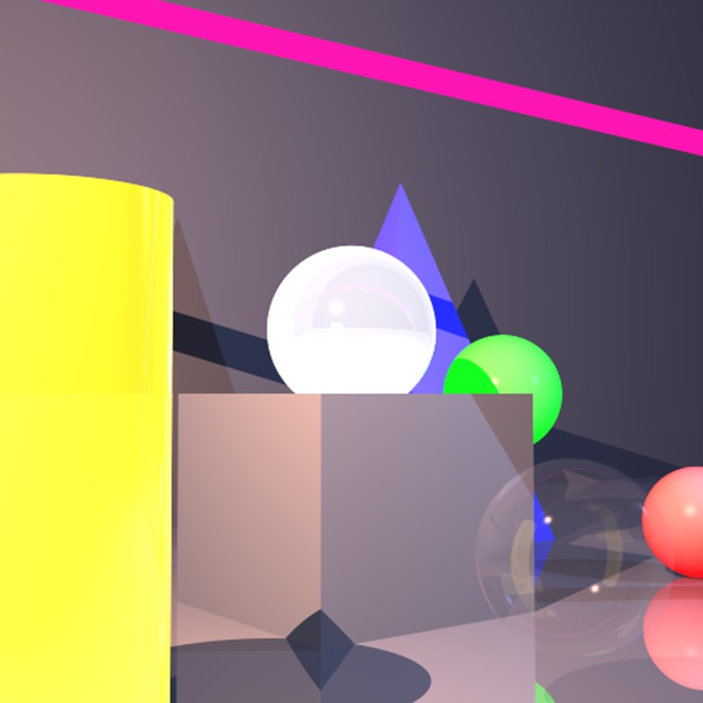
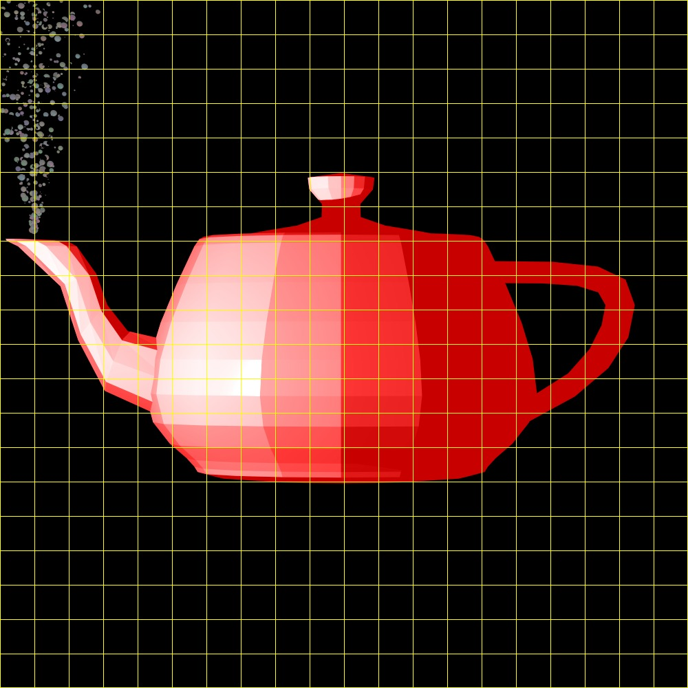

An advanced 3D Rendering Engine based on the **Ray Tracing** algorithm, built completely from scratch in Java. This project demonstrates fundamental and advanced computer graphics concepts, vector mathematics, and software engineering design patterns.

## 🚀 Features

- **Geometric Primitives:** Supports rendering of spheres, planes, triangles, polygons, tubes, and cylinders.
- **Advanced Lighting & Materials:** Includes ambient light, directional light, point lights, and spotlights with attenuation factors. Materials support diffuse and specular reflection, transparency, and shininess.
- **Camera System:** Fully customizable virtual camera supporting operations like target-based aiming, manual orientation, and orbital movement around objects.
- **Performance Optimizations:**
  - **Multithreading:** High-performance rendering utilizing Parallel Streams or custom raw thread pooling with dynamic pixel distribution.
  - **BVH (Bounding Volume Hierarchy):** Spatial acceleration structures using Axis-Aligned Bounding Boxes (AABB) to eliminate redundant intersection calculations.
- **Robust Design Patterns:** Heavy utilization of the **Builder Pattern** for flexible object construction (e.g., Camera construction).

---

## 🛠️ Architecture & Package Structure

The project is strictly structured around clean code and object-oriented principles:

- **`primitives`**: Core mathematical structures including `Vector`, `Point`, `Ray`, `Color`, and geometric utilities.
- **`geometries`**: Theoretical shapes and composite geometries implementing intersection logic (`Intersectable`).
- **`lighting`**: Implementation of various light sources, shading models, and atmospheric effects.
- **`scene`**: Complete scene description encapsulating geometries, backgrounds, ambient lights, and light components.
- **`renderer`**: The core execution engine containing the `Camera` system, `ImageWriter`, `PixelManager` for thread safety, and specialized `RayTracerBase` implementations.
---
⚡ Performance Tuning (Multithreading)
The engine supports a flexible setMultithreading(int threads) configuration:

0: Single-threaded execution (default).

-1: Leverages Java's Parallel Streams framework.

-2: Automatically detects available system cores and allocates dedicated worker threads dynamically via a custom PixelManager.

>0: Spawns a specific hardcoded number of worker threads.
---
👥 Authors

Nerya Cohen - neryh1997@gmail.com

Yehuda Kupperman - yehudtray@gmail.com

---
Examples of images created with an explanation:



Recursive Ray Tracing & Optical Physics: Demonstrating advanced simulation of light behavior, including dynamic reflections, material refractions, and multi-source shadowing, calculated through precise 3D vector intersections.



High-Polygon Mesh Rendering & Algorithmic Optimization: Showcasing the rendering of complex 3D models utilizing spatial data structures (AABB) to significantly accelerate processing times and intersection calculations.


---
## 💻 Code Example

Here is a quick look at how a 3D scene is set up and rendered using the Camera Builder API:

```java
// 1. Create a 3D Scene
Scene scene = new Scene("My Awesome Scene")
    .setBackground(new Color(10, 20, 40))
    .setAmbientLight(new AmbientLight(new Color(java.awt.Color.WHITE), new Double3(0.15)));

// Add geometries and lights to the scene...
scene.geometries.add(new Sphere(new Point(0, 0, -50), 30));
scene.lights.add(new PointLight(new Color(500, 300, 300), new Point(100, 100, 100)));

// 2. Configure the Camera using the Builder Pattern
Camera camera = Camera.getBuilder()
    .setLocation(new Point(0, 0, 100))
    .setDirection(new Point(0, 0, -50)) // Look at the sphere
    .setViewPlaneSize(200, 200)
    .setViewPlaneDistance(100)
    .setResolution(800, 800)
    .setRayTracer(scene, RayTracerType.SIMPLE)
    .setMultithreading(-2) // Auto-detect optimal CPU cores
    .setBvhEnabled(true)   // Turn on BVH acceleration
    .build();

// 3. Render and save the image
camera.renderImage()
      .printGrid(50, new Color(java.awt.Color.GRAY)) // Optional diagnostic grid
      .writeToImage("rendered_output");


